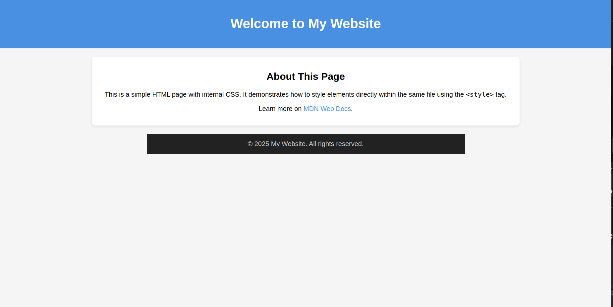

# 🌐 Static Website Hosting with Amazon S3 & CloudFront

This project demonstrates how to host a simple static website using **Amazon S3**, and serve it globally with low latency via **Amazon CloudFront**.

---

## ✅ Steps I Followed

### 1. Created the Website

- Built a basic `index.html` file with simple content.

### 2. Set Up the S3 Bucket

- Logged into the AWS Management Console.
- Created a new S3 bucket with a unique name.
- **Kept the bucket private** by not enabling public access.

### 3. Uploaded Website Files

- Uploaded the `index.html` file to the S3 bucket.

### 4. Configured CloudFront

- Opened the **CloudFront** section in AWS.
- Created a new **CloudFront distribution**.
- Selected the S3 bucket as the **origin**.
- Enabled **Origin Access Control (OAC)** to secure S3 access.
- Set the **default root object** to `index.html`.

### 5. Accessed the Live Website

- Visited the **CloudFront distribution URL**.
- ✅ The website loaded successfully — served from the nearest AWS edge location.

---

## 🌍 S3 static website hosting url

🔗 [Live URL (S3 Static website hosting):](http://websitehost-jain.s3-website-us-east-1.amazonaws.com)
## 🌍 Live Website

🔗 [View Website Hosted via CloudFront](https://ddooalaw9gcte.cloudfront.net/)

---

## 🖼 Screenshot

---

## 📌 Key Concepts I Learned

- Hosting static websites securely using **Amazon S3**.
- Leveraging **Amazon CloudFront** for global content delivery.
- Setting up **Origin Access Control (OAC)** to protect S3 content.
- How **CDNs (Content Delivery Networks)** cache and serve content faster.

---

## 🛠️ Tech Stack

- **HTML**
- **AWS S3**
- **AWS CloudFront**

---

